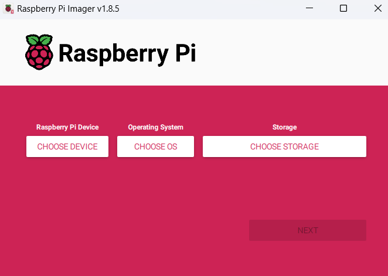
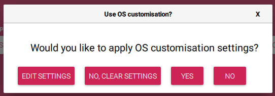
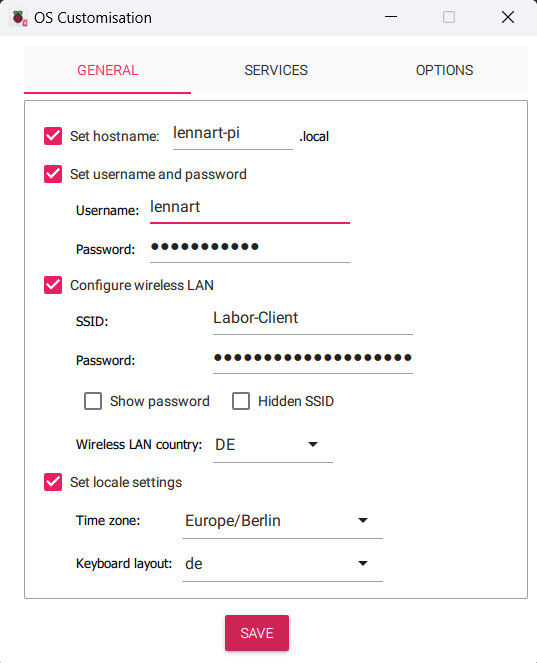

# Einrichtung eines Rasberry Pi

## Aufgabe 1
### Schritt 1
Lade den Raspberry PI Imager herunter: [Klick](https://www.raspberrypi.com/software/)

### Schritt 2
Schließe die SD-Karte an dein Laptop/Computer an

### Schritt 3
Wähle unter "Raspberry Pi Device" dein Gerät aus. In unserem Falls Raspberry Pi 4
Wähle unter "Operating System" "Raspberry Pi OS Lite" aus.
Wähle unter "Storage" die angeschlossene SD Karte aus


Drücken anschließend auf `Next`.

Nun öffnet sich dieses Fenster

Klicke hier auf `Edit Settings`

Nun öffnet sich ein neues Fenster, in welchem wir folgende Informationen eintragen:
\
Hostname: Dein Hostname
Username: Dein Username
Password: Dein Passwort
WLAN: In unserem Fall `Labor-Client` & Passwort
Locale Settings: `Europe/Berlin`
Keyboard layout: `de` 

### Im Tab `Services`:
Aktiviere:
`Enable SSH`
`Use password authentication`


Klicke nun auf `Save` um die Einstellungen zu speichern.
Anschließend schließt sich das Fenster wieder und wir landen wieder im vorherigen Menü:


Dort klicken wir jetzt auf `Yes` und der Imager schreibt nun unser Raspberry OS auf unsere SD-Karte.
Sobald das fertig ist, wird das Gerät ausgeworfen und wir können es in den Raspberry Pi einstecken und diesen an den Strom anschließen.

### Schritt 2
Verbindung via. SSH testen, dafür nutzen wir das zuvor konfigurierte Gerät.
Wir haben als Hostname `dustin-pi.local` festgelegt und als nutzer `dustin`.
Das ganze sieht dann folgendermaßen aus:
```
PS C:\Users\d.j.eden> ssh dustin@dustin-pi.local
```
Anschließend werden wir nach dem festgelegten Passwort gefragt.

## Aufgabe 2
Nun wollen wir, dass der Raspberry Pi in den Schul-Hotspot kommt.
Dieser ist ein WLAN-Netzwerk, welches über einen Radius Server geschützt ist.
Die Herausforderung ist also unsere Zugangsdaten auf dem Pi gehasht zu hinterlegen.
Unsere aktuelle Konfiguration nach der Installation sieht folgendermaßen aus:
```
lennart@lennart-pi:~ $ sudo cat /etc/wpa_supplicant/wpa_supplicant.conf
ctrl_interface=DIR=/var/run/wpa_supplicant GROUP=netdev
update_config=1

network={
        ssid="Labor-Client"
        psk=578abce8e3f9a9a00cb37328f78a7166a5017d077a4dcd480074887318649231
}
```

Diese wollen wir jetzt anpassen bzw. erweitern.\
Wir nutzen dafür den `nano` command, dieser lautet dann `sudo nano /etc/wpa_supplicant/wpa_supplicant.conf` und dort ergänzen wir folgende Zeilen:\
```
network={
    ssid="YourSSID"
    key_mgmt=WPA-EAP
    eap=PEAP
    identity="YourUsername"
    password="YourPassword"
    phase2="auth=MSCHAPV2"
}
```

Neben dem zweiten Block ergänzen wir noch `priority` damit es einen Fallback auf die erste Option bzw. SSID gibt.\
Unsere Datei sieht am Ende also folgendermaßen aus:
```
ctrl_interface=DIR=/var/run/wpa_supplicant GROUP=netdev
update_config=1
country=DE

#network={
#        ssid="Labor-Client"
#        psk=578abce8e3f9a9a00cb37328f78a7166a5017d077a4dcd480074887318649231
#        priority=2
#}

network={
        ssid="Schul-Hotspot"
        proto=RSN
        key_mgmt=WPA-EAP
        pairwise=CCMP
        auth_alg=OPEN
        eap=PEAP
        identity="lennart213"
        password="*****"
        phase1="peaplabel=0"
        phase2="auth=MSCHAPV2"
        priority=1
}
```

> [!NOTE]
> Damit die Verbindung erfolgreich hergestellt werden kann, musste ich den oberen Network Block auskommentieren

Nun müssen wir unseren Pi einmal neustarten.\
Anschließend sehen wir mit dem Befehl `ip a` dass wir auf dem Interface wlan0 die IP-Adresse `10.109.131.179` erhalten haben.\
```
lennart@lennart-pi:~ $ ip a
1: lo: <LOOPBACK,UP,LOWER_UP> mtu 65536 qdisc noqueue state UNKNOWN group default qlen 1000
    link/loopback 00:00:00:00:00:00 brd 00:00:00:00:00:00
    inet 127.0.0.1/8 scope host lo
       valid_lft forever preferred_lft forever
    inet6 ::1/128 scope host
       valid_lft forever preferred_lft forever
2: eth0: <BROADCAST,MULTICAST,UP,LOWER_UP> mtu 1500 qdisc pfifo_fast state UP group default qlen 1000
    link/ether b8:27:eb:eb:85:b3 brd ff:ff:ff:ff:ff:ff
    inet 169.254.172.37/16 brd 169.254.255.255 scope global noprefixroute eth0
       valid_lft forever preferred_lft forever
    inet6 fe80::49f9:e1be:5876:2160/64 scope link
       valid_lft forever preferred_lft forever
3: wlan0: <BROADCAST,MULTICAST,UP,LOWER_UP> mtu 1500 qdisc pfifo_fast state UP group default qlen 1000
    link/ether b8:27:eb:be:d0:e6 brd ff:ff:ff:ff:ff:ff
    inet 10.109.131.179/16 brd 10.109.255.255 scope global dynamic noprefixroute wlan0
       valid_lft 56559sec preferred_lft 49359sec
    inet6 fe80::6349:a590:f663:7689/64 scope link
       valid_lft forever preferred_lft forever
lennart@lennart-pi:~ $
```

Die Verbindung zum Schul-Hotsport ist erfolgreich!
